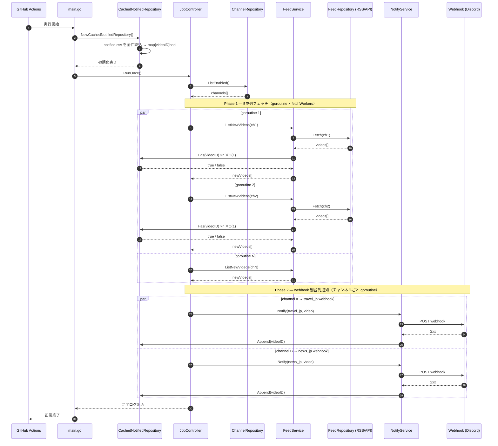
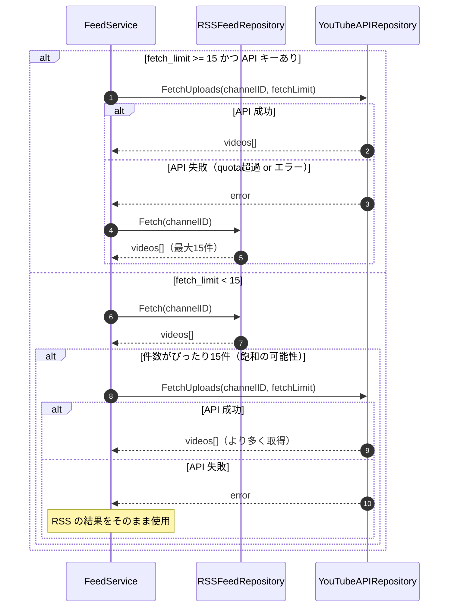
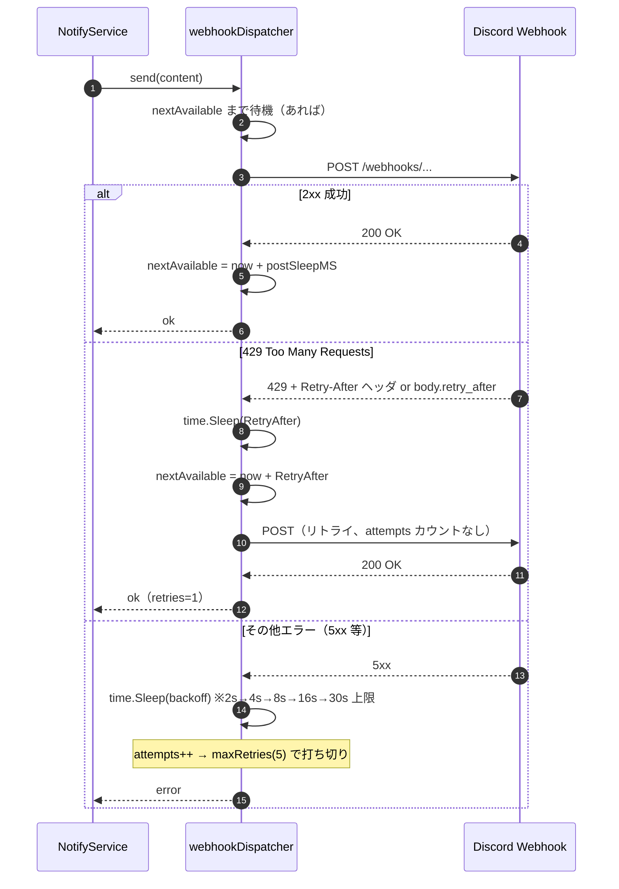
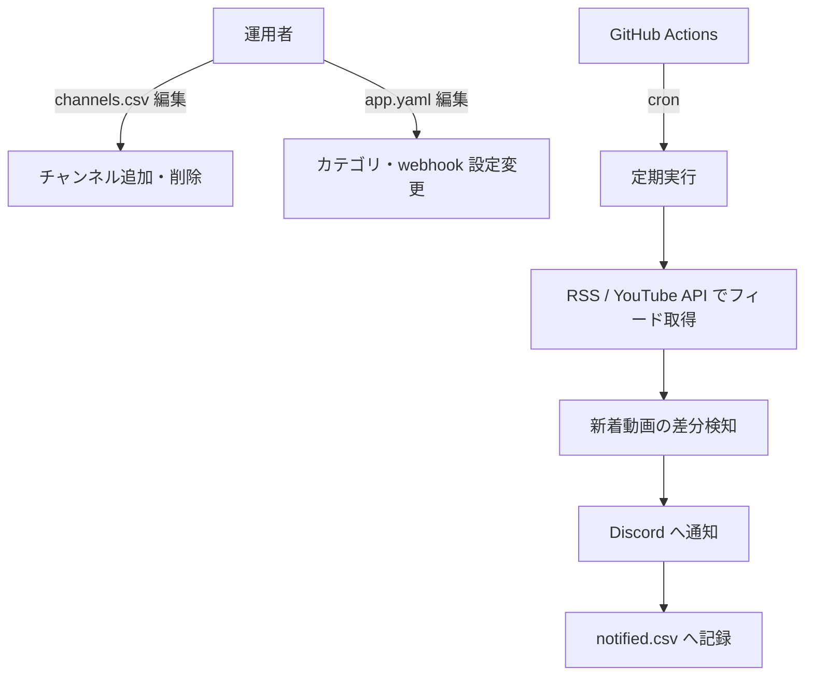

# 機能設計書

## 機能ごとのアーキテクチャ

### レイヤー構成

```
cmd/job/main.go          依存解決・起動
internal/controller/     ジョブ全体のオーケストレーション
internal/service/        ビジネスロジック（フィード取得・通知）
internal/repository/     データアクセス（CSV・RSS・YouTube API）
internal/notifier/       Discord Webhook HTTP クライアント
internal/model/          DTO 定義
config/                  YAML・.env ファイルローダー
```

依存方向: `controller → service → repository`（逆依存禁止）

## コンポーネント設計

| コンポーネント | 役割 |
|---|---|
| `JobController` | Phase1（並列フェッチ）と Phase2（並列通知）を制御 |
| `FeedService` | RSS / YouTube API の切り替えと重複除外 |
| `NotifyService` | webhook ディスパッチ・レート制御・リトライ |
| `CachedNotifiedRepository` | 起動時に notified.csv を全件読込み、Has() を O(1) で提供 |
| `CSVChannelRepository` | channels.csv からチャンネル一覧を読込む |
| `RSSFeedRepository` | YouTube RSS XML をパースして VideoDTO を返す |
| `YouTubeAPIRepository` | playlistItems API でアップロード一覧を取得 |
| `DiscordNotifier` | Discord Embed Webhook POST・429 ハンドリング |

## データモデル定義

### channels.csv

| フィールド | 型 | 説明 |
|---|---|---|
| channel_id | string | YouTube チャンネル ID（UC...） |
| category | string | 通知カテゴリ（travel_jp, news_jp 等） |
| name | string | チャンネル名（任意） |
| enabled | bool | false の場合スキップ |
| fetch_limit | int | 15 以上で YouTube Data API を使用 |

### notified.csv

| フィールド | 型 | 説明 |
|---|---|---|
| video_id | string | YouTube 動画 ID（主キー相当） |
| channel_id | string | 動画のチャンネル ID |
| published_at | RFC3339 | 動画の公開日時 |
| notified_at | RFC3339 | 通知した日時 |

## シーケンス図

### 全体フロー（並列フェッチ・並列通知）



### RSS / YouTube API 切り替えフロー



### Discord レート制限ハンドリング



## ユースケース図


