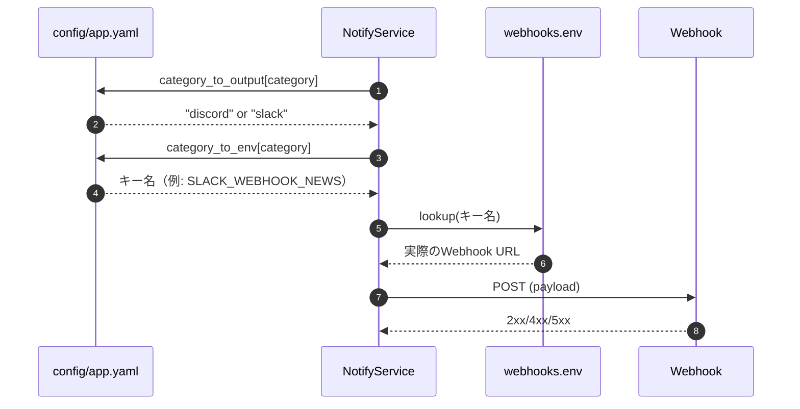

# シーケンス — カテゴリ→出力先/キー マッピング

```mermaid
sequenceDiagram
autonumber
participant Cfg as config/app.yaml
participant NS as NotifyService
participant Sec as webhooks.env
participant WB as Webhook


NS->>Cfg: category_to_output[category]
Cfg-->>NS: "discord" or "slack"
NS->>Cfg: category_to_env[category]
Cfg-->>NS: キー名（例: SLACK_WEBHOOK_NEWS）
NS->>Sec: lookup(キー名)
Sec-->>NS: 実際のWebhook URL
NS->>WB: POST (payload)
WB-->>NS: 2xx/4xx/5xx
```
