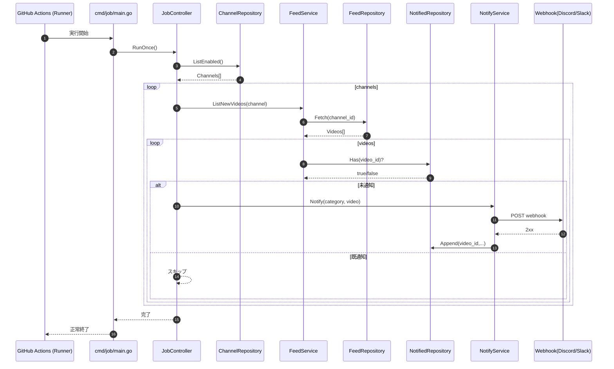

# シーケンス — RunOnce 全体フロー

```mermaid
sequenceDiagram
autonumber
participant GH as GitHub Actions (Runner)
participant Main as cmd/job/main.go
participant C as JobController
participant CH as ChannelRepository
participant FS as FeedService
participant FR as FeedRepository
participant NR as NotifiedRepository
participant NS as NotifyService
participant WB as Webhook(Discord/Slack)


GH->>Main: 実行開始
Main->>C: RunOnce()
C->>CH: ListEnabled()
CH-->>C: Channels[]
loop channels
C->>FS: ListNewVideos(channel)
FS->>FR: Fetch(channel_id)
FR-->>FS: Videos[]
loop videos
FS->>NR: Has(video_id)?
NR-->>FS: true/false
alt 未通知
C->>NS: Notify(category, video)
NS->>WB: POST webhook
WB-->>NS: 2xx
NS->>NR: Append(video_id,...)
else 既通知
C-->>C: スキップ
end
end
end
C-->>Main: 完了
Main-->>GH: 正常終了
```
